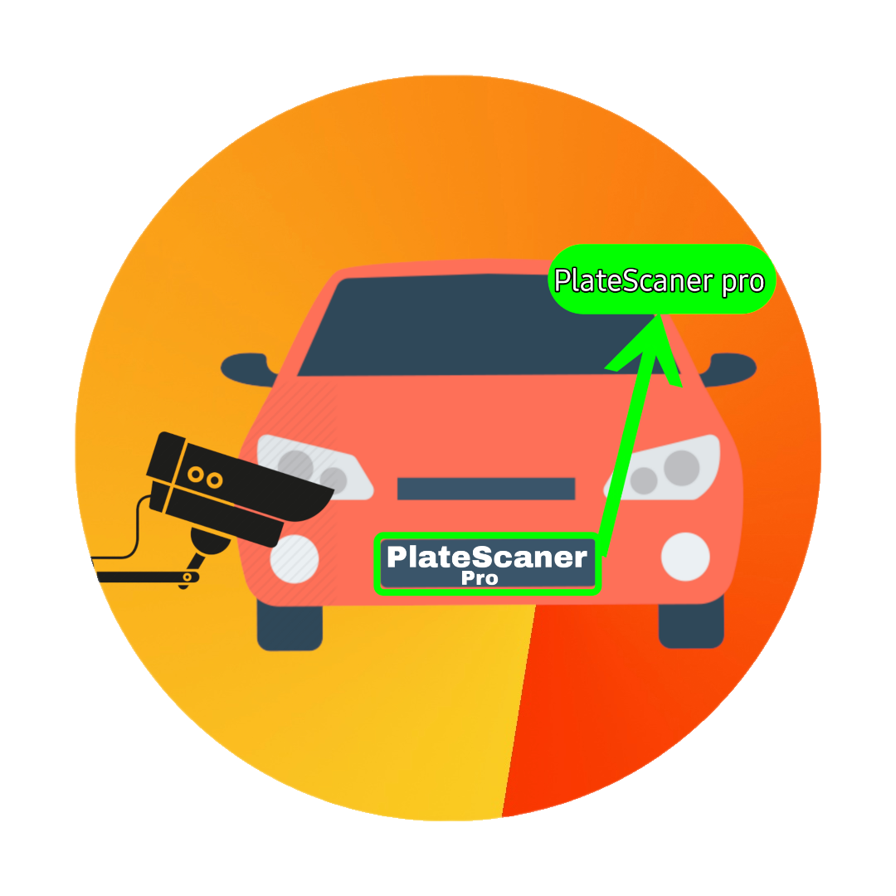

<p align="center">
  <a href="" rel="https://github.com/MurtadaNazar/PlateScaner-Pro">
 </a>
</p>

<h3 align="center">PlateScaner Pro</h3>

---

<p align="center"> In this project, I used Yolo V8 by Ultralytics to make this project work.
    <br>
The application’s task is to extract car plate numbers accurately by using the techniques mentioned above.
</p>

## 📝 Table of Contents

- [About](#about)
- [Getting Started](#getting_started)
- [Deployment](#deployment)
- [Usage](#usage)
- [Built Using](#built_using)
- [TODO](../TODO.md)
- [Contributing](../CONTRIBUTING.md)
- [Authors](#authors)
- [Acknowledgments](#acknowledgement)

## 🧐 About <a name = "about"></a>

Introducing "PlateScaner Pro" a cutting-edge web application built with Flask, Yulo V8, and trOCR that revolutionizes car plate number extraction. This powerful tool is designed to streamline and enhance various industries, including parking management, law enforcement, and access control systems. PlateScaner Pro combines the flexibility of Flask with the robust capabilities of Yulo V8 and trOCR to deliver a seamless and accurate solution for extracting car plate numbers from images or video feeds.

Whether monitoring parking lots, identifying vehicles at security checkpoints, or managing toll booths, PlateScaner Pro simplifies the process by swiftly recognizing and extracting license plate numbers. With its user-friendly interface, real-time processing, and high precision, this web application ensures efficiency and reliability in your plate recognition tasks. PlateScaner Pro is your go-to solution for automating the extraction of car plate numbers, making it an invaluable asset for businesses and organizations that rely on efficient and accurate vehicle identification.

## 🏁 Getting Started <a name = "getting_started"></a>

These instructions will get you a copy of the project up and running on your local machine for development and testing purposes. See [deployment](#deployment) for notes on how to deploy the project on a live system.

### Prerequisites

What things do you need to install the software and how to install them?

#### 1-clone the repository

```shell
$ git clone https://github.com/MurtadaNazar/PlateScaner-Pro.git
```

#### 2-create the environment

```shell
# conda
conda create -n yolov8-nlpr python=3.9.16
conda activate yolov8-nlpr

# windows
python -m venv yolov8-nlpr
# In cmd.exe
venv\Scripts\activate.bat
# In PowerShell
venv\Scripts\Activate.ps1

# linux
python -m venv yolov8-nlpr
source yolov8-nlpr/bin/activate
```

### Installing

#### 1-install the requirements

```shell
pip install -r requirements.txt
```

#### 2- Run the web app

```shell
flask run --debug
# or
flask run
```

> ```bash
> ⚠️ Note: To get the best result, please upload a vertical shot, without a tilt
> or angle, and in good lighting conditions
> ```
>
> ```bash
> ⚠️ Note: When you run the application for the first time, it will download some relatively large files,
> witch are the trOCR Models
> ```

## ⛏️ Built Using <a name = "built_using"></a>

- [Flask](https://flask.palletsprojects.com/en/2.3.x/) - Server Framework - Web Framework
- [Python](https://www.python.org/) - Server Environment
- [Yolo V8](https://docs.ultralytics.com/) - ML Model

## ✍️ Authors <a name = "authors"></a>

- [@MurtadaNazar](https://github.com/MurtadaNazar) Training the model & create the web app

## 🎉 Acknowledgements <a name = "acknowledgement"></a>

- [Aymen Saad](https://scholar.google.com/citations?user=PP2qKBgAAAAJ) - supervising this project And the one who came up with the idea
